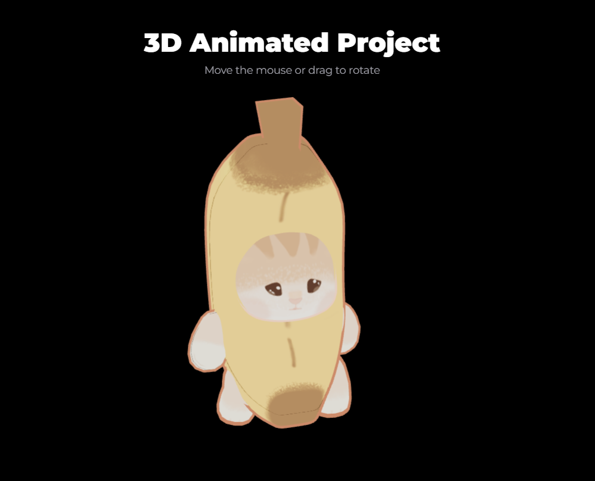

# 3D Animated Project

React + Vite page that renders an animated 3D model in the browser using
[React Three Fiber](https://r3f.docs.pmnd.rs/) and [drei](https://drei.docs.pmnd.rs/).

This project is available on https://3dcat.hadama.com.br/
<p align="center">

</p>

## Scripts

```bash
npm install      # install dependencies
npm run dev      # development server
npm test         # tests (Vitest, watch mode)
npm run test:run # run tests once
npm run build    # production build in dist/
npm run lint     # ESLint
```

## Structure

```
public/models/      # arquivos .gltf/.bin/texture files (served as-is)
src/
├── components/
│   ├── common/     # Loader and other reusable components
│   └── layout/     # Header, Footer
├── data/           # Content and metadata (e.g., model credits)
├── three/
│   ├── models/     # Components that load each model
│   └── scenes/     # Canvas, camera, lights, controls
└── styles/         # global.css and design tokens
```

## Credits

This project uses "Cute Cat in Cute Banana"
(https://sketchfab.com/3d-models/cute-cat-in-cute-banana-fb3eee24c9fc422ea256b95d5148931f)
by SOBOL (https://sketchfab.com/sbl-cool), license by CC-BY-4.0
(http://creativecommons.org/licenses/by/4.0/).
